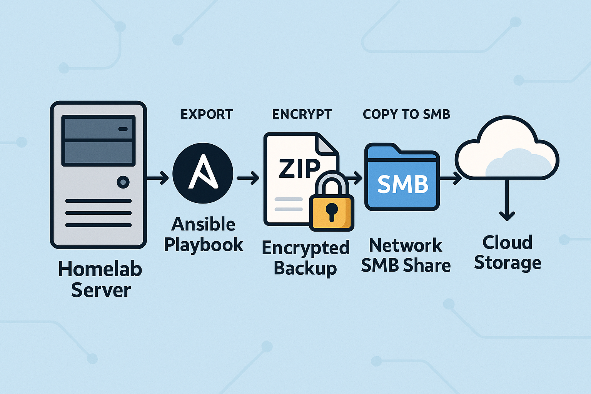

As my data consumption and storage needs grow - both at work and at home - reliable automation becomes non-negotiable. Over the past week, I have invested much needed time to my *homelab_ansible* GitHub repository; focusing on crafing a robust backup playbook for my **paperless-ngx** deployment. My goal? A backup workflow I trust to safeguard my documents, regardless of infrastructure or underlying OS.

<!-- more -->

## Getting started

I kicked things off by creating a new playbook that centered around the usage of the **document_exporter** CLI tool included with **paperless-ngx**. With GitHub Copilot lending a subtle hand, the scaffolding came together rather quickly. I did need to tweak what modules were initially suggested for various sections, such as shell vs command. However, secrets management - always a sticking point in cybersecurity -- called for some extra attention. I created two Ansible Vaults: one for the SMB credentials, and the other for a GPG encryption passphrase. Both of these I initially tested with the `-J` vault-password prompt.

But you quickly realize after a few tests, that an interactive password prompt is cumbersom and not automation! My next step was shifting the vault keys outside of the the repo, updating my *.gitignore*, and templating the vault files so only *example-vault.yml* ships with my repo to GitHub. These are small but critical details for clean and secure source control and future use.

Building this playbook out, I also took the opportunity to make it OS-agnostic - supporting both apt and dnf based distros out of the box. I have both Debian and RedHat environments, and being able to redeploy **paperless-ngx** to either is future-proofing in action. The playbook checks for and installs utilities as needed for SMB, GPG, and CIFS; then runs the export, encrypts the zip file created, and copies the encrypted file to my SMB share.

## Unprivileged LXC snag

One snag when I set out copying to my SMB share was my original attempt at mounting the SMB share locally. My **paperless-ngx** is running on a Proxmox LXC which is an unprivileged container. These don't play well with mount operations! So instead of mounting the SMB share, I pivoted to using smbclient and the build in *put* option.

## Next steps

I'm not stopping here. "It runs" is never good enough for a highly analytical and must-constantly-be-improving mindset individual!

What's on the roadmap currently:

- **Integrity importance**: file checksums before deleting the original on the host
- **Cloud insurances**: automating offsite copies to Azure or Google Drive
- **Smarter retention**: Daily backups, plus weekly, monthly, yearly roolups - pending a deeper look at storage overhead.
- **Archive strategies**: Keeping what's relevant in paperless-ngx while balancing archived data and backups.

Why does all this matter? Because homelabs are real-world playgrounds for the kind of reliability and automation every security engineer needs. By treating my own data with discipline -- automation, encryption, secrets storage, cross-platform compatibility -- I practice the skills (and the mindset) I want to bring everywhere.

