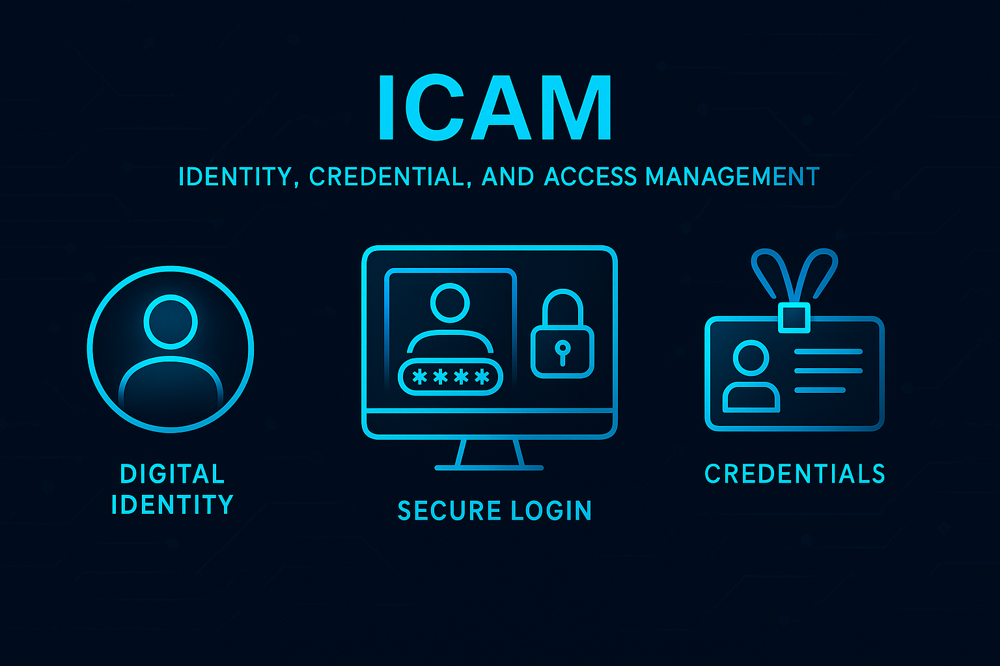

Identity, Credential, and Access Management, commonly referred to as ICAM, marks a fundamental evolution from the traditional approaches to access control in organizations.

What do traditional access controls look like? In simple terms, it was straightforward: usernames and passwords. Physical access secured through ID cards or PINs; system and resource access granted through basic logins. Most of this managed manually by IT or security staff. And unless someone forgot their password or hit a forced password reset deadline, accounts and permissions were rarely reviewed or updated!

It's astonishing! Such methods were once (and in some cases, still are) the norm!

But organizations today face far more complex challenges. Let's take a closer look.

<!-- more -->

## The rise of ICAM

What ICAM represents therefore, is not just an upgrade but a comprehensive rethink of how identities and access are managed. ICAM integrates several modern security principles:

- **Holistic Integration**: Unifies the management of both physical and digital access; a coordinated approach for identities and systems.
- **Automated Lifecycle**: Replace manual processes with automated workflows for onboarding, changes, offboarding, and reviews to minimize errors and delays.
- **Zero Trust Architecture**: Shift the focus from trusting everything inside the perimeter to continuous verification: *never trust, always verify*.
- **Risk-Based Access**: Grant access dynamically, factoring in context, attributes, and risk instead of relying on static, outdated roles.
- **Federation & Interoperability**: Seamless and secure sharing of identity data across organizational and external boundaries; essential for partnerships and cloud services.

This evolution is necessary! Because modern environments add complexity:

- Cloud and hybrid IT environments
- Remote and flexible workforces
- Supply chain and third-party access
- Strict regulatory compliance
- Sophisticated and evolving cyber threats

An effective ICAM strategy addresses all of these and provides for both security and agility in the organization.

## Key components of ICAM

Let's break down the core elements of ICAM further:

**Identity Management**

Focuses on the creation and oversight of *digital identities*, which represent people, devices, or services. A crucial part of this is *identity proofing*, which verifies that a claimed identity actually matches an individual or entity using a trusted source. Throughout its *lifecycle*, each identity is carefully managed, covering all stages beginning with initial creation and onboarding, through role changes or adjustments, and finally to eventual deactivation or deletion when the identity is no longer needed.

**Credential Management**

Involves selecting and handling the *authentication methods* used to verify an identity, whether its passwords, multi-factor tokens, digital certificates, or similar technologies. The *lifecycle* of the credentials is actively managed as well, using processes to create, update, and securely remove them regularly. *Attestation* plays a critical role by ensuring that issued credentials remain trustworthy and have not been compromised. This maintains the *integrity* of the overall system.

**Access Management**

Determines what resources and actions each *authenticated identity* can access within a system (known as *authorization*). It also covers *provisioning*, which the granting and revoking of *access rights* as needed. This is based on established business rules and roles. To ensure *security and compliance*, systems *continually monitor and control* which active *sessions* are open, while also maintaining *comprehensive audits* that log access attempts and activity. This provides essential records for both regulatory needs and incident investigations (when necessary).

## Putting it all together

ICAM represents a modern, unified, and comprehensive approach to managing digital identities and access. It isn't just about tools! While traditional methods focused on simple username/password combinations, ICAM delivers:

- A unified framework for managing identities
- Centralized and consistent identity management across all systems and resources
- Automated processes that reduce human error
- Risk-based decisions which adapt to changing threats in real-time
- Robust audit trails for oversight, incident response, and compliance

The key to successful ICAM implementation lies in understanding the fundamentals and applying them systematically across your organization. As cyber threats evolve utilizing AI-driven methods, ICAM will continue to be a critical component of any security and zero trust strategies.

